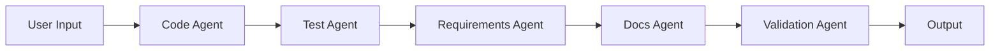
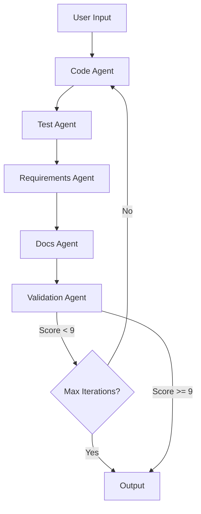

# Code Generation Agent - Prompt Chaining & Feedback Loop with Snowflake Cortex

This code repository is created as part of **DAMG 7374 Gen AI w/ LLM Spring 2026 semester** - Lab session 

A Streamlit application demonstrating two agentic patterns using multiple specialized AI models through Snowflake Cortex:
1. **Prompt Chaining** - Linear sequential execution
2. **Feedback Loop** - Iterative improvement with validation (target score: 9/10)

## Overview

This application creates a complete software development workflow using 5 specialized AI agents:

| Agent | Model | Responsibility |
|-------|-------|----------------|
| Code Generation | Claude-3.5-Sonnet | Generates & refines production-ready Python code |
| Test Generation | Llama4-Maverick | Creates comprehensive pytest test suites |
| Requirements | Mixtral-8x7b | Analyzes dependencies and versions |
| Documentation | Llama4-Scout | Writes professional README files |
| Validation | Mistral-7b | Reviews, scores, and provides actionable feedback |

## Agentic Patterns

### Pattern 1: Prompt Chaining

Linear sequential execution where each agent runs once and passes output to the next.



**Characteristics:**
- Single-pass execution
- Fast execution time
- No self-correction
- Quality depends on initial generation

**Use case:** Quick prototyping when speed matters more than perfection.

### Pattern 2: Feedback Loop

Iterative improvement cycle where validation feedback triggers code refinement until quality score reaches 9/10.



**Characteristics:**
- Iterative refinement cycles
- Self-correcting based on feedback
- Targets production-quality code (9/10 score)
- Validation provides specific improvements needed

**Quality Scoring Criteria:**
- **9-10:** Production-ready with type hints, logging, custom exceptions, comprehensive error handling
- **7-8:** Good code but missing best practices
- **5-6:** Functional but needs significant improvements
- **Below 5:** Major issues or incomplete

**Use case:** Production code generation where quality is critical.

## Project Structure

```
project/
├── app.py                    # Main Streamlit app with mode selection
├── agent_chain.py            # Orchestrates both execution patterns
├── agents.py                 # Agent classes with execute/refine methods
├── agent_prompts.py          # Prompts including refinement & feedback prompts
├── snowflake_connection.py   # Snowflake Cortex API integration
├── requirements.txt          # Python dependencies
├── .env                      # Snowflake credentials (create this)
└── README.md                 # This file
```

## Setup Instructions

### 1. Install Dependencies

```bash
pip install -r requirements.txt
```

### 2. Configure Snowflake Authentication

Create a `.env` file in the project root:

```bash
SNOWFLAKE_USER=your_username
SNOWFLAKE_PASSWORD=your_pat_token_here
SNOWFLAKE_ACCOUNT=your_account_identifier  
SNOWFLAKE_WAREHOUSE=COMPUTE_WH
SNOWFLAKE_DATABASE=your_database
SNOWFLAKE_SCHEMA=PUBLIC
```

**Getting Your PAT Token:**
1. Login to Snowflake web interface
2. Go to your profile → "My Profile" → "Tokens" tab
3. Click "Generate Token"
4. Set expiration (recommend 90+ days for development)
5. Copy the token and use as your password in `.env`

### 3. Verify Snowflake Access

Ensure your Snowflake account has access to these Cortex models:
- `claude-3-5-sonnet`
- `llama4-maverick`
- `mixtral-8x7b`
- `llama4-scout`
- `mistral-7b`

### 4. Run the Application

```bash
streamlit run app.py
```

The application will open in your browser at `http://localhost:8501`

## Usage Guide

1. **Select Execution Mode** in the sidebar:
   - **Prompt Chaining** - Single-pass generation
   - **Feedback Loop** - Iterative improvement (set max iterations 1-5)

2. **Enable "Show Backend Process"** to observe:
   - Prompts sent to each model
   - Raw model responses
   - Iteration feedback details

3. **Enter your requirement** or select an example prompt

4. **View generated files** in the tabbed interface:
   - 💻 Code - Main Python script
   - 🧪 Tests - Pytest test suite
   - 📦 Requirements - Dependencies file
   - 📚 README - Documentation
   - ✅ Review - Validation assessment
   - 📈 Iterations - (Feedback Loop only) Improvement history

## Key Concepts Demonstrated

| Concept | Description |
|---------|-------------|
| Multi-Model Orchestration | Different LLMs optimized for different tasks |
| Prompt Chaining | Sequential agent execution with output passing |
| Feedback Loops | Iterative improvement based on validation scores |
| Agentic Patterns | Autonomous task completion with self-correction |
| Structured Prompts | Specific output formats for reliable parsing |

## Troubleshooting

| Issue | Solution |
|-------|----------|
| Connection failed | Verify `.env` credentials and account identifier format |
| Model not found | Ensure your Snowflake account has Cortex model access |
| Timeout errors | Check warehouse size and consider scaling up |
| Stuck at score 8 | Increase max iterations; refinement prompt enforces improvements |
| Empty responses | Review prompt formatting and input length |
